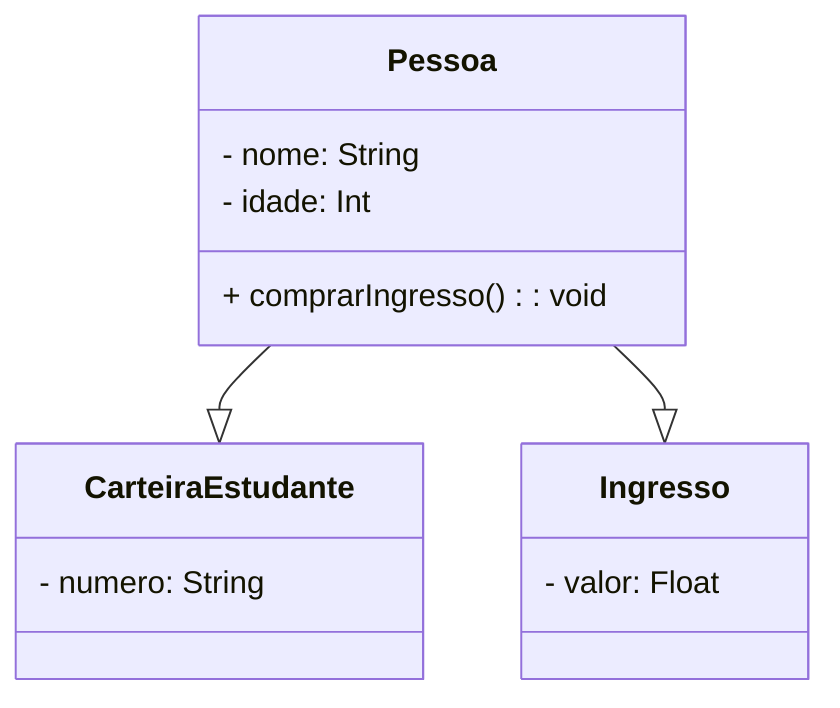

# testar-mermaid

```mermaid
classDiagram
  class Pessoa {
    - nome: String
    - idade: Int
    + comprarIngresso(): void
  }
  class CarteiraEstudante {
    - numero: String
  }
  class Ingresso {
    - valor: Float
  }

  Pessoa --|> CarteiraEstudante
  Pessoa --|> Ingresso
```
